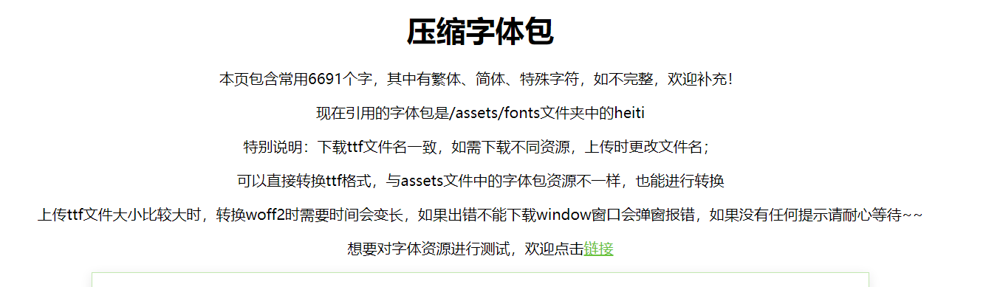
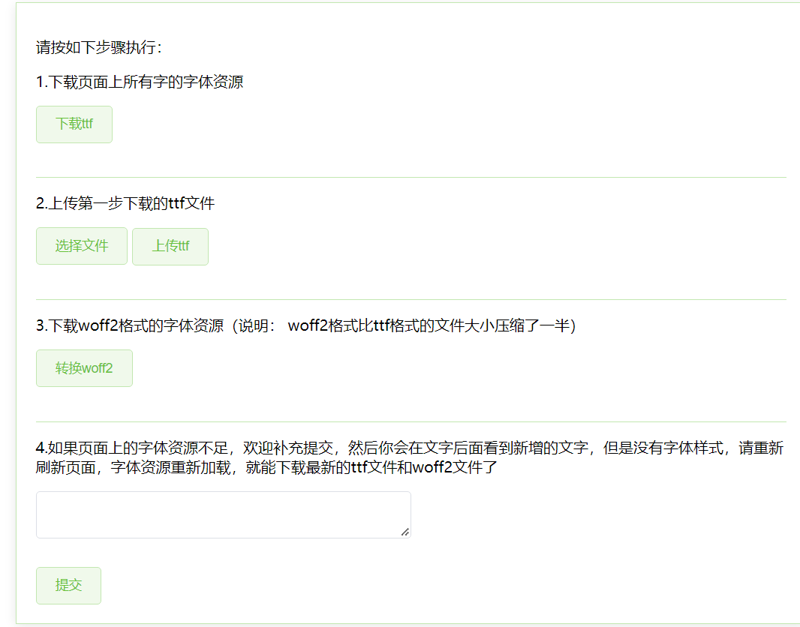
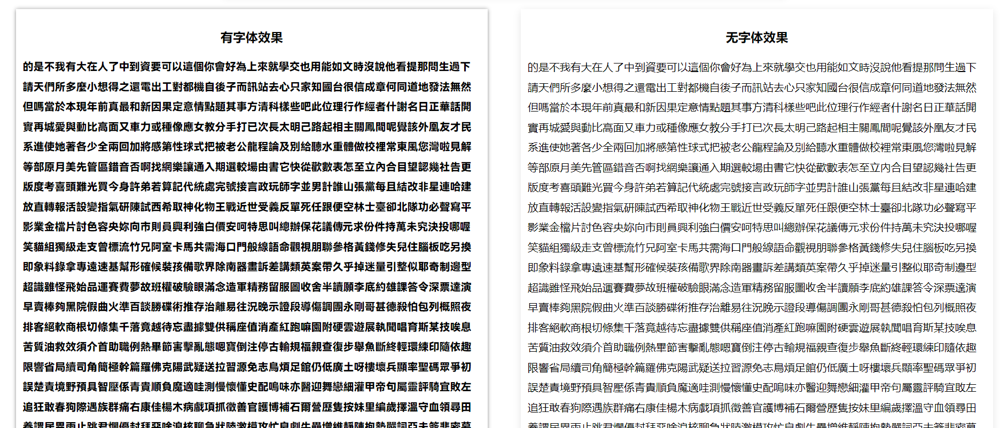
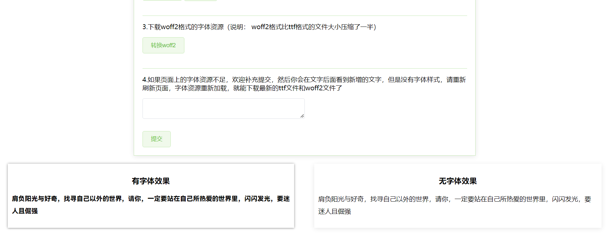

# font_compressed

#### 介绍
根据全量字体包，提取出常见字，从而达到压缩字体包的效果

#### 软件架构
软件架构说明
1. 使用fontmin提取字体资源(https://github.com/ecomfe/fontmin)
2. 服务由express搭建
3. 使用ttf2woff2把字体ttf格式转换为woff2格式

#### 安装教程

1.  下载依赖包 命令：`yarn`,使用npm下载会报错
2.  `nodemon app.js`,启动项目
3.  控制台输入地址，进入首页，`http://localhost:3000/`

#### 使用说明

1.  动态加载页面字体，可下载当前页面上所有字的ttf字体包（未实现）
2.  上传ttf字体包
3.  下载woff2字体包（体积是ttf字体包的一半）

### 使用介绍

1. 打开首页，地址：`http://localhost:3000/`

首页：

注意查看温馨提示，本页面中包含了常见的6691个字，先是繁体，然后是简体，最后是特殊字体，没有区分出来是因为，繁体中有些字跟简体一样，为了更好的压缩字体包资源，就放在了一起，增加文字，字体包资源就会变大。

2. 首页功能：

   可以直接按照如下步骤执行，也可以根据你需要的功能进行，比如你只想要把已有的字体包ttf格式转换为woff2，可以直接执行步骤2，然后步骤3，就能完成

3. 对比有字体资源和无字体资源样式，可以找到本页面中不存在的常见字，然后进行补充

4. 可以直接进入测试页面，进行功能测试，地址`http://localhost:3000/active`

测试页面方便开发，也更加方便判断缺少的文字，功能与首页一致，就是比首页更少文字，由于下载文件资源是根据文字多少来判定的，所以测试页面下载速度更快。如果没有上传ttf文件，就点击了转换woff2按钮，下载的woff2就是默认页面资源，也就是heiti

#### 参与贡献

1.  Fork 本仓库
2.  新建 Feat_xxx 分支
3.  提交代码
4.  新建 Pull Request

